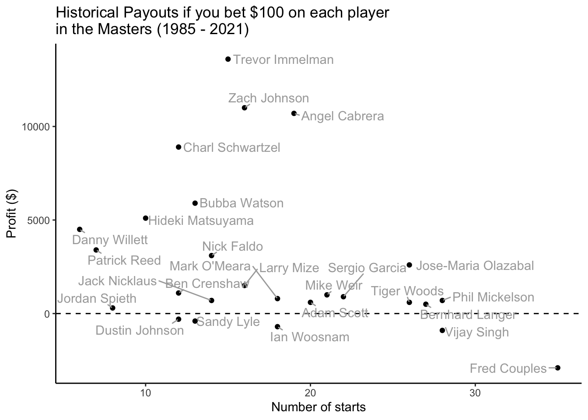
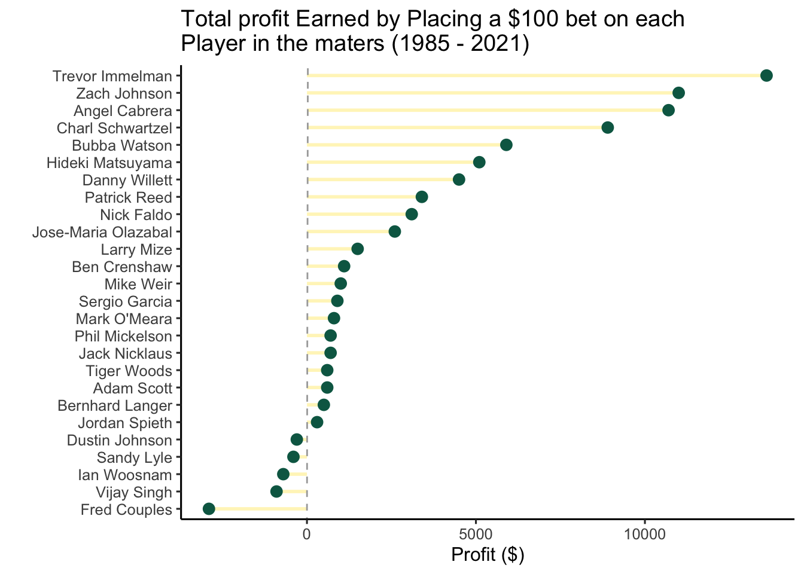

analysis
================
Jordan Hutchings
25/10/2021

The main question of interest is simply, how much money would you make
from betting $100 on a given tour golfer. This analysis was motivated by
the question, if you were to bet $100 on Tiger Woods in each major he
competed in, how much money would you have today.

## Game plan

1.  Scrape betting lines for the Major Champions from here:
2.  Calculate payoffs per player
3.  Visualizations

The majority of the work here will be to properly scrape the betting
odds data and field lists for each of the majors in our dataset.

Once we have the data, it will simply be a count of each player name,
and the sum of their winning odds times $100.

## Scraping the data

We can use `rvest` to collect the names of the players on a webpage.
Notice the webpages we are intested in share very simular URL structure.
This allows us to rip through each year collecting the table elements
and saving into dataframes for easy analysis.

``` r
pacman::p_load(rvest, dplyr, ggplot2, ggrepel)

# get player list for a given webpage ----
url <- "https://www.sportsoddshistory.com/golf-main/?y=2021&sa=golf&a=mast&o=r"
html <- read_html(url)
tbl <- html %>%
  html_table()
tbl[[2]]$Player
```

    ##   [1] "Player"                  "Hideki Matsuyama"       
    ##   [3] "Xander Schauffele"       "Will Zalatoris"         
    ##   [5] "Justin Rose"             "Marc Leishman"          
    ##   [7] "Jordan Spieth"           "Corey Conners"          
    ##   [9] "Brian Harman"            "Tony Finau"             
    ##  [11] "Justin Thomas"           "Si Woo Kim"             
    ##  [13] "Patrick Reed"            "Cameron Smith"          
    ##  [15] "Jon Rahm"                "Viktor Hovland"         
    ##  [17] "Bernd Wiesberger"        "Robert MacIntyre"       
    ##  [19] "Collin Morikawa"         "Bryson DeChambeau"      
    ##  [21] "Cameron Champ"           "Matt Fitzpatrick"       
    ##  [23] "Tommy Fleetwood"         "Ryan Palmer"            
    ##  [25] "Bubba Watson"            "Abraham Ancer"          
    ##  [27] "Matt Jones"              "Tyrrell Hatton"         
    ##  [29] "Scottie Scheffler"       "Shane Lowry"            
    ##  [31] "Stewart Cink"            "Dustin Johnson"         
    ##  [33] "Webb Simpson"            "Paul Casey"             
    ##  [35] "Christiaan Bezuidenhout" "Brooks Koepka"          
    ##  [37] "Jason Kokrak"            "Rory McIlroy"           
    ##  [39] "Daniel Berger"           "Adam Scott"             
    ##  [41] "Kevin Kisner"            "Max Homa"               
    ##  [43] "Gary Woodland"           "Joaquin Niemann"        
    ##  [45] "Francesco Molinari"      "Mackenzie Hughes"       
    ##  [47] "Sergio Garcia"           "Harris English"         
    ##  [49] "Matt Wallace"            "Ian Poulter"            
    ##  [51] "Patrick Cantlay"         "Sungjae Im"             
    ##  [53] "Louis Oosthuizen"        "Phil Mickelson"         
    ##  [55] "Sebastian Munoz"         "Brendon Todd"           
    ##  [57] "Henrik Stenson"          "Michael Thompson"       
    ##  [59] "Billy Horschel"          "Kevin Na"               
    ##  [61] "Charl Schwartzel"        "Lee Westwood"           
    ##  [63] "Jason Day"               "Matthew Wolff"          
    ##  [65] "Dylan Frittelli"         "Danny Willett"          
    ##  [67] "Lanto Griffin"           "Martin Laird"           
    ##  [69] "Hudson Swafford"         "Matt Kuchar"            
    ##  [71] "Zach Johnson"            "Jimmy Walker"           
    ##  [73] "Bernhard Langer"         "Robert Streb"           
    ##  [75] "Larry Mize"              "Joe Long"               
    ##  [77] "Victor Perez"            "Jim Herman"             
    ##  [79] "Jose Maria Olazabal"     "CT Pan"                 
    ##  [81] "Charles Osborne"         "Carlos Ortiz"           
    ##  [83] "Brian Gay"               "Ian Woosnam"            
    ##  [85] "Mike Weir"               "Fred Couples"           
    ##  [87] "Vijay Singh"             "Tyler Strafaci"         
    ##  [89] "Sandy Lyle"              "Tiger Woods"            
    ##  [91] "Rickie Fowler"           "Russell Henley"         
    ##  [93] "Thomas Pieters"          "Brandt Snedeker"        
    ##  [95] "Erik van Rooyen"         "Rasmus Hojgaard"        
    ##  [97] "Byeong Hun An"           "Charles Howell III"     
    ##  [99] "Martin Kaymer"           "Chez Reavie"            
    ## [101] "Adam Hadwin"             "Joohyung Kim"           
    ## [103] "Graeme McDowell"         "Jazz Janewattananond"   
    ## [105] "Shugo Imahira"           "Angel Cabrera"          
    ## [107] "Trevor Immelman"         "FIELD"

``` r
# collect all players in the masters ----
pre_url <- "https://www.sportsoddshistory.com/golf-main/?y="
post_url <- "&sa=golf&a=mast&o=r"

years <- seq(1985, 2021, 1) #1985 start 

get_data <- function(x){
  # download html webpage, take names from second table on the page, 
  # this will break if the table order differs - but it seems to be 
  # consistent based on checking some webpages. 
  cat("Collecting Masters ", x, "\n")
  Sys.sleep(runif(n = 1, 0.5, 1)) # hopefully this is pretty chill of a wait time
  path <- paste0(pre_url, x, post_url)
  html <- read_html(path)
  tbl <- html %>%
    html_table()
  player_list <- tbl[[2]]$Player
  
  player_list
}

masters_players <- lapply(years, get_data)
```

    ## Collecting Masters  1985 
    ## Collecting Masters  1986 
    ## Collecting Masters  1987 
    ## Collecting Masters  1988 
    ## Collecting Masters  1989 
    ## Collecting Masters  1990 
    ## Collecting Masters  1991 
    ## Collecting Masters  1992 
    ## Collecting Masters  1993 
    ## Collecting Masters  1994 
    ## Collecting Masters  1995 
    ## Collecting Masters  1996 
    ## Collecting Masters  1997 
    ## Collecting Masters  1998 
    ## Collecting Masters  1999 
    ## Collecting Masters  2000 
    ## Collecting Masters  2001 
    ## Collecting Masters  2002 
    ## Collecting Masters  2003 
    ## Collecting Masters  2004 
    ## Collecting Masters  2005 
    ## Collecting Masters  2006 
    ## Collecting Masters  2007 
    ## Collecting Masters  2008 
    ## Collecting Masters  2009 
    ## Collecting Masters  2010 
    ## Collecting Masters  2011 
    ## Collecting Masters  2012 
    ## Collecting Masters  2013 
    ## Collecting Masters  2014 
    ## Collecting Masters  2015 
    ## Collecting Masters  2016 
    ## Collecting Masters  2017 
    ## Collecting Masters  2018 
    ## Collecting Masters  2019 
    ## Collecting Masters  2020 
    ## Collecting Masters  2021

``` r
tbl <- unlist(masters_players, use.names=FALSE)
tbl <- data.frame(tbl)
names(tbl) <- "Player"

# collect masters champions and their historical odds ----

major_odds <- "https://www.sportsoddshistory.com/golf-champs/"
mo <- read_html(major_odds)
mo <- mo %>%
  html_table()

masters_odds <- data.frame(mo[1])
masters_odds <- masters_odds %>%
  select(Player = Player, Odds = Prior.to...) %>%
  filter(Player != "Player")


# merge datasets ----
masters_appearences <- tbl %>%
  group_by(Player) %>%
  summarise(n = n())

masters_results <- masters_odds %>%
  mutate(payoff = as.numeric(Odds) + 100) %>%
  group_by(Player) %>%
  summarise(payouts = sum(payoff)) %>%
  left_join(masters_appearences, by = "Player") %>%
  mutate(profit = payouts - 100 * n,
         ev = payouts / (100 * n))
```

## Masters Analysis

I first used the Masters as a proof of concept. Below are some
visualizations of the top players in terms of total profit.

``` r
ggplot(masters_results, aes(x = n, y = profit, label = Player)) +
  geom_hline(yintercept = 0, linetype = "dashed") + 
  geom_point() + 
  geom_text_repel(hjust = -0.1, min.segment.length = 0.2, color = "darkgrey") + 
  theme_classic() + 
  labs(title = "Historical Payouts if you bet $100 on each player \nin the Masters (1985 - 2021)", 
       x = "Number of starts", 
       y = "Profit ($)")
```

<!-- -->

``` r
masters_results$Player <- reorder(masters_results$Player, masters_results$profit)
masters_results %>%
  ggplot(aes(x=Player, y=profit)) + 
  geom_segment(aes(x=Player, xend=Player, y=0, yend=profit), size = 1, color = "#ffdf00", alpha = 0.3) + 
  geom_point(size = 3, color = "#076652") + 
  coord_flip() + 
  theme_classic(12) + 
  labs(title = "Total profit Earned by Placing a $100 bet on each \nPlayer in the maters (1985 - 2021)", 
        y = "Profit ($)", 
        x = "") + 
    geom_abline(xintercept = 0, color = "darkgrey", linetype = "dashed")
```

<!-- -->
